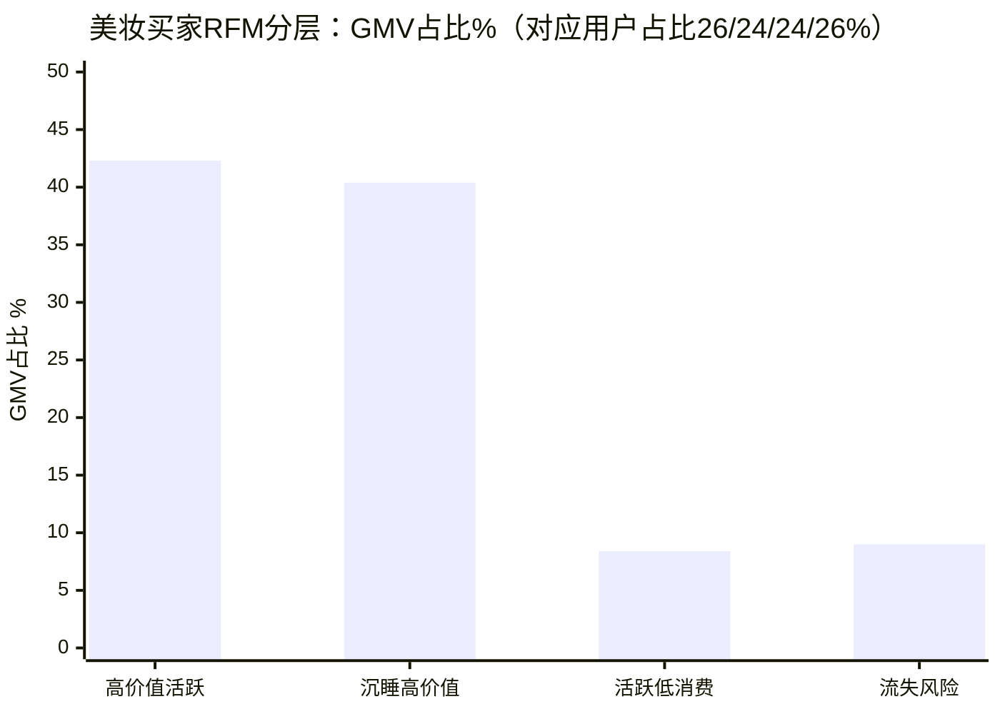
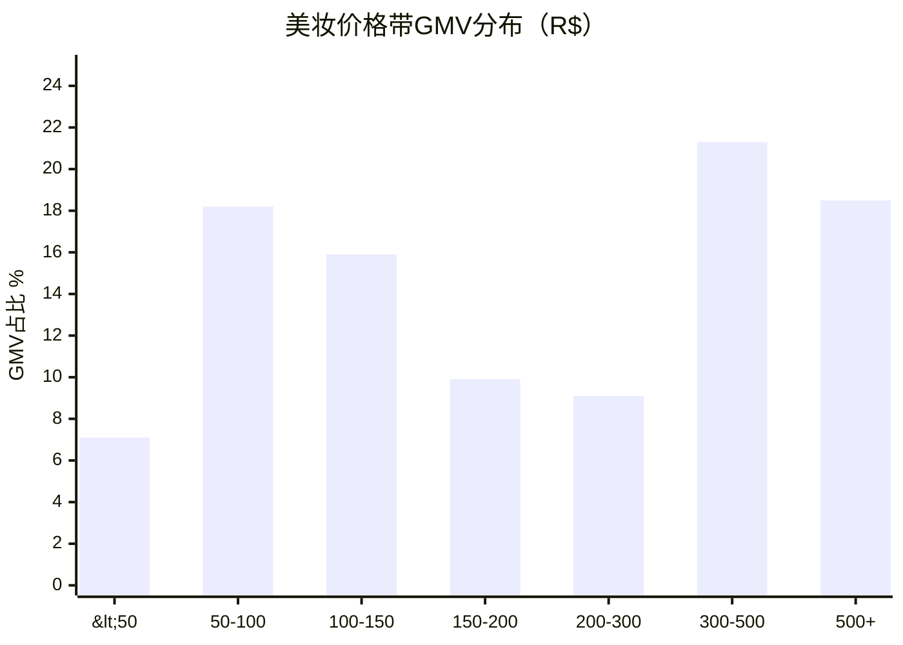
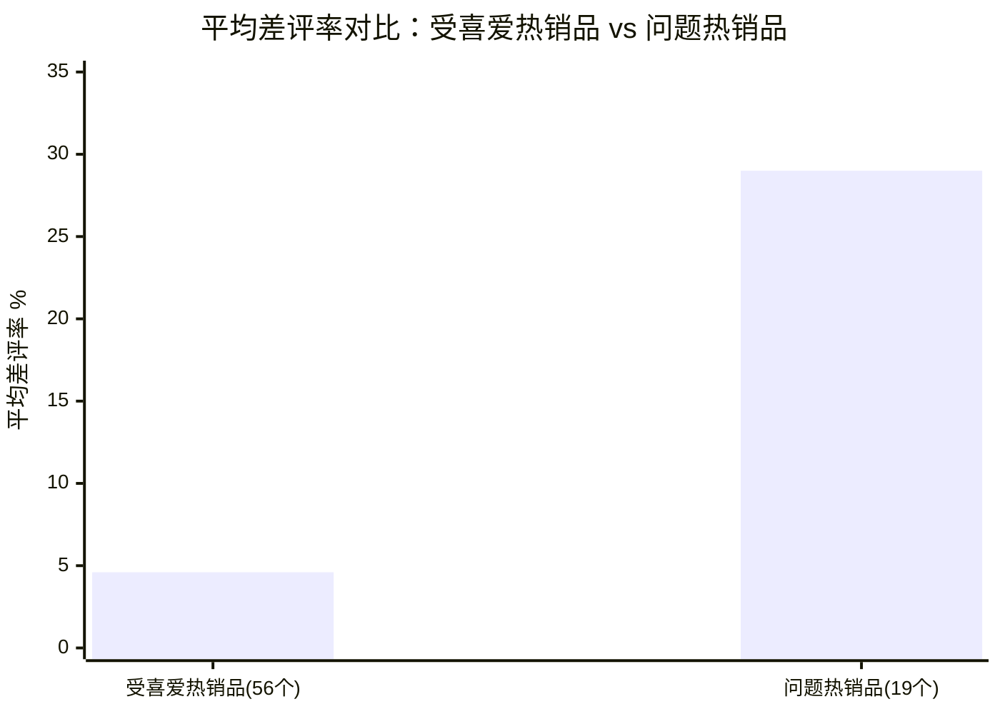
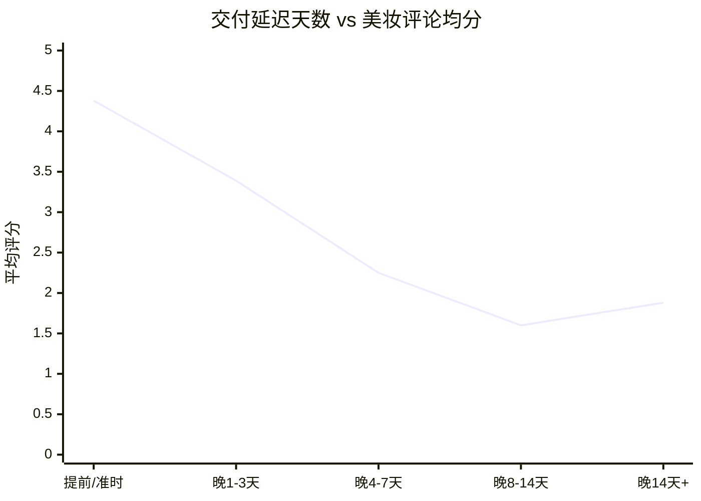

# 电商美妆类目用户画像与经营分析

> 基于 Olist 巴西电商公开数据集（Kaggle: Brazilian E-Commerce Public Dataset by Olist），
> 聚焦美妆类目（health_beauty + perfumery）的用户分层、复购、口碑归因与产品分析。
> 技术栈：SQL / SQLite / Python (pandas, matplotlib)

## 1. 项目背景与问题定义

Olist 是巴西的电商平台解决方案商，数据集覆盖 2016.09–2018.10 共 99,441 笔订单、
8 张原始表（订单、订单明细、支付、评论、用户、商品、卖家、类目翻译）。

美妆是观察"用户运营"最好的切口：它天然是高复购预期的品类，用户决策受口碑驱动，
且本数据集中 health_beauty 是 GMV 第一大类目（占比 9.5%），
加上 perfumery 合计占平台 GMV 的 12.4%（R$1.62M / R$13.2M）。

围绕四个业务问题展开：

1. **盘子**：美妆类目增长怎样，在平台里什么位置？
2. **用户**：谁在买美妆？高价值用户是谁，流失了谁？复购健不健康？
3. **产品**：哪些产品受喜爱，哪些产品在砸口碑？
4. **口碑**：美妆的差评是产品问题还是履约问题？运营应该把钱花在哪？

## 2. 数据处理（ETL）

- 8 张 CSV 清洗后写入 SQLite，按 订单-明细-支付-评论-用户-商品 建成规范化结构；
- 商品类目经翻译表统一为英文，只保留 `order_status = 'delivered'` 的 96,478 笔订单做经营分析；
- 用户口径用 `customer_unique_id`（同一证件号）而非 `customer_id`（每单一个），
  避免把复购率算成 0——这是本数据集最常见的口径错误；
- RFM 分位数分层前检查并列值，M 值用 `rank(method='first')` 打散再切分，保证四分位不塌缩。

## 3. 核心发现

### 3.1 盘子：美妆是第一大类目，增速跑赢大盘

- 美妆月 GMV 从 2017-01 的 R$17,479 增至 2018-08 的 R$144,231，约 8.2 倍；
- 年度口径：2017 年美妆 GMV 占平台 11.5%，2018 年 1–8 月升至 12.9%；
- 增长主要靠大盘扩张带动（渗透率并未显著提升），说明美妆在平台上还处于"跟着涨"阶段，
  缺独立的品类运营动作。

### 3.2 用户：复购是最大短板，沉睡高价值用户是最大富矿

- 美妆买家 11,523 人，客单价 R$138.5，与平台均值（R$137.0）持平；
- **美妆复购率仅 1.7%，低于平台的 3.0%**——一个理论上"用完就要补货"的品类，
  复购反而垫底，说明平台没有任何召回/订阅/补货提醒机制，用户流失是被动的；
- RFM 四分位分层（R、M 各四分，F 因 98% 用户只买 1 次退化为参考维度）：

| 分层 | 用户占比 | GMV 占比 | 人均 GMV (R$) |
|---|---|---|---|
| 高价值活跃 | 25.9% | 42.3% | 230.2 |
| 沉睡高价值 | 24.1% | 40.4% | 235.7 |
| 活跃低消费 | 24.3% | 8.4% | 48.6 |
| 流失风险 | 25.7% | 9.0% | 49.2 |

- 高价值两层合计 50% 的用户贡献 82.7% 的 GMV；
- **沉睡高价值用户 2,781 人、沉淀 GMV 占 40.4%**，单均消费 R$228，
  按 10% 唤醒率保守测算，一次召回活动即可带来约 R$63,370 增量 GMV，
  而成本只是一次 push/邮件触达——这是全项目 ROI 最高的一个动作。



### 3.3 价格带：300 雷亚尔以上是利润区

- 销量集中在 50–100 R$（大众款），但 GMV 集中在 300–500 R$（21.3%）和 500+ R$（18.5%），
  两个高价带合计贡献约 39.8% GMV；
- 美妆 SKU 3,254 个，TOP10 SKU GMV 占比仅 14.4%，长尾高度分散、无爆款依赖，
  适合"大众款引流 + 高端线赚毛利"的组合拳。



### 3.4 产品维度：哪些产品被喜爱，哪些在砸口碑

对销量 ≥5 的 512 个美妆产品按"销量 × 评分"做四象限分析（销量前 25% 为热销线）：

- **受喜爱产品**：热销且均分 ≥4.3 的共 56 个，占热销产品的 42%，是类目的口碑基本盘；
- **问题产品**：热销但均分 ≤3.8 的共 19 个（14%），平均差评率 29.0%，
  是受喜爱产品差评率（4.6%）的 6 倍以上；
- **差评地板效应**：受喜爱产品仍有约 4.6% 的差评率，结合 3.5 的履约归因，
  这层"地板"主要由物流等外部因素构成；差评率显著高于地板的产品才是真产品问题——
  这给出了一套可执行的区分口径：差评率 ≤5% 归因外部履约，≥15% 启动商品侧整改（下架/换供应商）；
- **连带极弱**：99.4% 的美妆订单是纯美妆单，多单率仅 2.1%，美妆订单几乎不带其他类目——
  平台没有凑单满减、连带推荐机制，"逛"的属性完全没有被激发，
  与 3.2 的低复购互相印证：这个平台的用户运营机制整体缺位。



### 3.5 口碑：差评的锅在物流，不在产品

- 美妆均分 4.24，高于平台 4.16；差评率（≤2 分）11.5%，低于平台 12.8%——产品本身没问题；
- 按交付延迟分桶看评分（美妆）：
  准时 4.38 → 晚 1–3 天 3.39 → 晚 4–7 天 2.25 → 晚 8–14 天 1.60；
- 延迟 4 天以上评分断崖式跌破 3 分，美妆延迟 4 天+订单占 5.2%；
- 结论：美妆品类口碑运营的优先级是**履约时效**（尤其高价带用户对时效更敏感），
  而不是商品侧整改——商品侧只需要处理 3.4 圈出的 19 个问题 SKU。



## 4. 运营建议清单

| 优先级 | 动作 | 依据 | 预期 |
|---|---|---|---|
| P0 | 沉睡高价值用户召回（push/邮件 + 召回券） | 24.1% 用户沉睡、沉淀 40.4% GMV | 10% 唤醒 ≈ +R$63k GMV |
| P0 | 补货周期提醒/订阅复购（按品类消耗周期推算触达时点） | 复购率 1.7% 显著低于品类属性应有水平 | 复购率向平台均值 3% 看齐 |
| P1 | 问题热销品整改清单：19 个高销量低评分 SKU 启动商品侧审查（下架/换供应商） | 问题品均差评率 29%，是受喜爱品的 6 倍 | 守住类目口碑基本盘 |
| P1 | 高价带（300+ R$）订单履约保障：优先发货、时效承诺 | 高价带贡献 39.8% GMV；延迟 4 天+评分 2.25 | 保护高毛利区口碑 |
| P2 | 连带机制建设：凑单满减、关联推荐（美妆×家居/运动为自然连带方向） | 多单率仅 2.1%，连带几乎为零 | 提客单价 |
| P2 | SP 州（38% GMV）以外区域的品类渗透投放 | 区域集中度高，MG/RJ 有用户无 GMV 深度 | 分散区域风险 |

## 5. 图表

完整图表（GMV 趋势、RFM 分层、价格带、履约×评分、产品四象限）由代码自动生成，
运行 `analysis.py` 后输出到 `figures/` 目录；核心图表已内嵌上文（Mermaid 渲染）。

## 6. 复现方式

```
data/        # Olist 原始 CSV（来源：Kaggle "Brazilian E-Commerce Public Dataset by Olist"）
analysis.py  # 全部分析代码，python analysis.py 一键复现
figures/     # 输出图表
```

分析口径与假设：
- GMV = Σ price（不含运费）；复购 = 同一 customer_unique_id 交付订单数 > 1；
- RFM 快照日 = 数据最大订单日期 + 1 天；热销线 = 销量前 25%（销量 ≥5 样本内）；
- 相关不代表因果：评分-时效关系为观察性结论，报告内已做口径声明。
